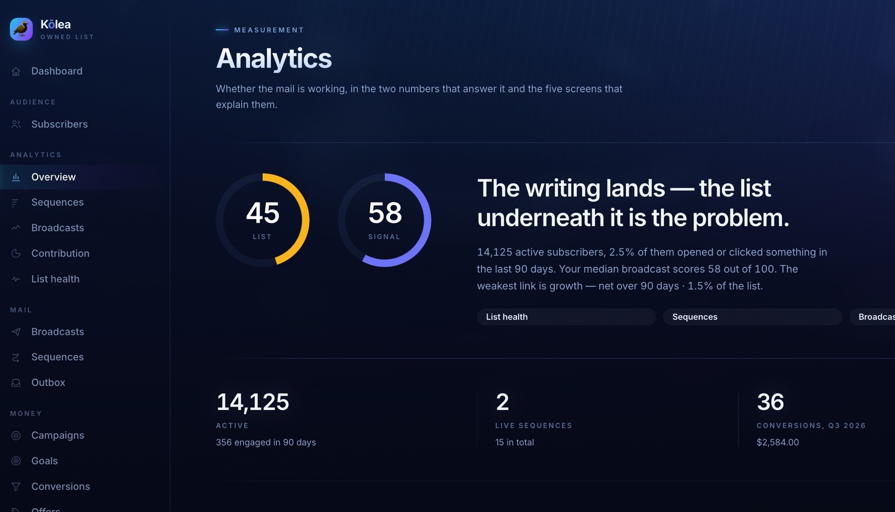

<div align="center">


# Kōlea

**Broadcasts, drip sequences, transactional email, and a blog — one Cloudflare Worker.**

*A self-hosted replacement for a paid ESP, where the list, the sending,*
*the engagement data, and the archive stay yours.*

[](https://github.com/robconery/kolea/actions/workflows/ci.yml)
[](LICENSE)
[](tsconfig.json)
[](https://workers.cloudflare.com/)

[Install](docs/INSTALL.md) · [Architecture](docs/ARCHITECTURE.md) · [Spec](docs/SPEC.md) · [Contributing](CONTRIBUTING.md)

</div>

---

## 🐦 Why Kōlea

The **kōlea** *(koh-LEH-ah)* — the Pacific golden plover — flies from Alaska to
Hawaiʻi every autumn. Three thousand miles of open ocean, nonstop, no land to
rest on. Then it lands in the same yard it left, and does it again the next year,
and the year after that.

Delivery, and the same address, every time. There isn't a better name for a
mailer.

---

> **Status:** feature-complete and runnable locally, and built for a **single
> operator** — not multi-tenant, by design rather than by omission.
> [`docs/INSTALL.md`](docs/INSTALL.md) is the honest list of what stands between
> a clone and a live send.


<sub>The dashboard after seeding demo data. **Consent, by scope** is the panel that
matters: two people left an individual series and are still on the list. On a normal
ESP those two numbers are the same number.</sub>

---

## 💡 The idea

Every ESP treats unsubscribe as one switch. Someone finishes your onboarding
series, clicks "unsubscribe" to stop *that*, and quietly leaves your newsletter
forever. You never find out. The number just goes down.

**Here, consent is scoped.** Leaving one sequence takes you off that sequence.
Leaving the newsletter doesn't cancel a series you deliberately opted into. Only
an explicit "unsubscribe from everything", a hard bounce, or a spam complaint
removes someone outright.

That asymmetry is the reason this exists, and everything else in the codebase is
arranged so it can't be broken by accident.

**And the mail is also the website.** A post *is* a broadcast — same piece, written
once, mailed to the list and up on its own readable URL as it goes out, with a "read
this online" link in the mail that already resolves. Not a second CMS bolted on, and
not a sync job between two copies of your own writing.

---

## 🚀 Install

### 🐦 The fast way: `/onboard`

Clone it, open [Claude Code](https://claude.com/claude-code) in the folder, and type
`/onboard`:

```bash
git clone https://github.com/robconery/kolea.git
cd kolea
claude          # then type: /onboard
```

It welcomes you in and asks one question at a time. Pick **look around locally** and
you're in the admin with demo data in about two minutes. Pick **go live** and it does the
whole production install on your own Cloudflare account, using nothing but a Cloudflare
API token (it tells you where to get one and exactly which boxes to tick):

| It asks you | It does |
|---|---|
| Your name, your from address, your login address | Fills in `wrangler.jsonc` from [`wrangler.template.jsonc`](wrangler.template.jsonc) |
| Which domain, and what to call the admin host | Checks the hostnames are free, creates D1, both R2 buckets and both queues |
| Whether you want the public site, and what it's called | Creates the Cloudflare Access login (one Allow app, eight Bypass paths) |
| A Resend API key | Adds your domain to Resend and writes the SPF, DKIM and DMARC records into Cloudflare DNS for you, then points bounces and complaints at the webhook |
| Stripe, Unsplash, AI help? (all optional) | Stores the keys as Worker secrets |
| "Ready to push to production?" | Migrates, deploys, seeds your profile and signup form, mints your first admin key, and checks the login is in front of the right things |

Nothing goes to production until you say yes to that last question, and **onboarding
never sends a single email.** Your first send is a test to yourself, from the admin,
when you're ready. Stop at any point and `/onboard` picks up where you left off. Your
answers live in `.onboard/` (gitignored).

The engine is [`scripts/onboard.ts`](scripts/onboard.ts), so you can drive it by hand
too: `bun scripts/onboard.ts` lists the steps.

### 🏝 The manual way

Three commands, and it mails nobody.

```bash
git clone https://github.com/robconery/kolea.git
cd kolea
bun install
bun run db:migrate     # applies migrations to the local D1 database
bun run dev            # → http://localhost:8787
```

Open <http://localhost:8787> and click **Seed demo data**: twelve people, two live
series, a sent broadcast. Then open the **Outbox** to read the mail that "went out."

> ### 🔒 Nothing leaves your machine
>
> `EMAIL_PROVIDER=console` is the local default. It writes fully rendered mail —
> footer, merge tags, tracking links and all — to the in-app Outbox instead of
> sending it. No API key needed, and no way to accidentally mail a real person
> while you poke at it.

**You need:** [Bun](https://bun.sh) 1.1+. That's the whole list for local. No
database to install, no Redis, no server — `wrangler dev` emulates D1, R2 and
Queues locally.

**Going live by hand?** → **[`docs/INSTALL.md`](docs/INSTALL.md)** walks the full
deploy: D1, R2, queues, DNS and DMARC, the Cloudflare Access apps, secrets, and
a pre-flight checklist to work through *before* you trust it with a list. It
takes about an hour, most of it waiting for DNS, and there are two steps that
are painful to undo. `/onboard` does the same steps in the same order.

---

## 💸 How much is all of this going to cost?

Running it locally costs nothing. Running it for real costs **about $25 a month** for most
lists under 50,000 emails a month: $5 to Cloudflare and $20 to Resend. Both are flat
fees. Kōlea doesn't charge you per subscriber the way a hosted ESP does, so a list
that grows from 500 to 15,000 people costs about the same to run.

### 🧾 The services, and which tier you need

| Service | What Kōlea uses it for | Tier you need | Cost |
|---|---|---|---|
| **Cloudflare Workers** | The app itself, plus D1 (the database), Queues (sending) and Cron (schedules) | **Workers Paid** | **$5/month** |
| **Cloudflare R2** | Uploaded images and lead-magnet files | Free tier: 10 GB, no bandwidth charges | Free for almost everyone. $0.015/GB-month past 10 GB |
| **Cloudflare Zero Trust** | The login in front of your admin console | Free plan. You're one user | Free. Cloudflare asks for a card when you sign up |
| **A domain on Cloudflare** | Your admin host, your site, your sending address | Any registrar. Cloudflare just has to run its DNS | What you already pay, roughly $10 to $15/year |
| **Resend** | Putting mail on the wire | **Pro** once you send more than 100 emails a day | Free up to 100/day and 3,000/month. **$20/month** for 50,000, then $0.90 per 1,000 |
| **Stripe** *(optional)* | Crediting sales to the mail that earned them | Your existing account | Nothing extra. Kōlea only reads |
| **Unsplash** *(optional)* | Stock photos when you publish a post | Free demo tier (50 searches an hour) | Free |
| **OpenRouter** *(optional)* | AI writing help | Pay as you go | Pennies per use. Capped at $10/month unless you change it |

Resend's separate "Marketing" plans are priced per contact. You don't need them: Kōlea
does the list management itself and only uses Resend to send.

### ⚠️ Why not the free Cloudflare plan?

Queues used to be paid-only, and they aren't anymore. But the free Workers plan has
three other limits that stop Kōlea from sending, even for a small list:

| Limit | Free | Paid | What breaks |
|---|---|---|---|
| Database queries per request | 50 | 1,000 | Kōlea writes send records 10 at a time, so a 500-person broadcast needs ~50 writes before anything else. Sequences process 200 people per tick. Both would stall. |
| CPU time per request | 10 ms | 30 s | Building a batch of 100 personalised emails takes far more than 10 ms. |
| Resend free tier | 100 emails/day | $20/mo for 50k | A 500-person broadcast is blocked by Resend before Cloudflare even matters. |

The $5 includes more than a mailing list will use: 10 million requests, 1 million
queue operations (about 330,000 emails, at roughly three operations each), 50 million
database writes and 5 GB of database a month.

### 📐 What that looks like for real lists

| Your list | Mail a month (weekly newsletter, plus sequences) | Cloudflare | Resend | Total |
|---|---|---|---|---|
| 500 people | ~2,500 | $5 | $20 (the free tier's 100 a day can't fit one broadcast) | **~$25** |
| 5,000 people | ~22,000 | $5 | $20 | **~$25** |
| 15,000 people | ~65,000 | $5 | $20 + ~$14 overage | **~$39** |

### 🪙 Getting it cheaper

The biggest cost is Resend, and it's replaceable. Kōlea's mail provider is one adapter
file (see [Make it yours](#-make-it-yours)). **Amazon SES** charges $0.10 per 1,000
emails, so a 500-person list would cost about 5 cents a broadcast and the whole setup
would run for about $5 a month. **There is no SES adapter yet.** It's the next thing
worth building for small lists. A "small list" mode that fits the free Workers plan's
limits would be a larger change to how sending works, and it isn't planned.

<sub>Prices as published by each provider in September 2026. Check their pricing pages
before you rely on a number here.</sub>

---

## 🎯 Try the thing it's for

1. **Subscribers** → pick someone → **Open their preference center**
2. Add `?scope=sequence:2` to that URL. This is what a link inside a sequence email
   looks like.
3. Hit **Stop just this series**
4. Go back to their subscriber page: still `active`, still on the newsletter, out of
   exactly one series
5. **Consent** shows everyone who left a single series versus the (empty) list of
   people gone entirely

Send a broadcast afterwards and they'll still receive it. That's the whole argument.

Sequence delays are in **days**, and the first step defaults to 0 (arrives on join)
while later steps default to 1. Which means a seeded series won't finish while you
watch it, so the dashboard has **Fast-forward the clock** (local only): it pulls every
pending step to now and runs a tick. Use it and you'll watch step 2 skip the people
who left that series.

---

## 🧭 A tour of the console

Everything in the left rail, top to bottom, and what it's for. There's also a manual
built into the app at **System → Help** (`/help`), with every URL and `curl` already
filled in for wherever you're running it.

### 🏠 Dashboard

Where the list stands today: who's on it, who left what, what went out and what's in
draft. The **Consent, by scope** panel is the one to look at. It separates people who
left one series from people who left everything. Locally, it's also where **Seed demo
data** and **Fast-forward the clock** live.

### 👥 Audience

| Screen | What it's for |
|---|---|
| **Subscribers** | Everyone you know about. Open anyone to see their tags, their sequences, every mail they got and what they did with it, and a link to their preference center exactly as they'd see it. CSV import is here too. |
| **Tags & automation** | Tags are facts you store about people. *Automation* is tag rules: "clicked this link → tag them", and a tag can start a sequence. That chain (click, tag, enroll) is how someone who shows interest gets the follow-up without you doing anything. |
| **Segments** | Saved questions about the list ("tagged `customer`, not tagged `cohort-2`, joined this year"). A broadcast goes to a segment. The count you see is the count the send will produce, from the same function. |

### ✉️ Mail

| Screen | What it's for |
|---|---|
| **Broadcasts** | One-off mail to a segment: the newsletter. Write it in the block editor, send yourself a test, schedule it or send it. A broadcast can also be published as a post on your public site. |
| **Sequences** | Drip series: a list of steps with a delay in days between them, started by a form, a tag or a signup. People can leave one series without leaving anything else. A sequence is created paused; activating it is a deliberate click. |
| **Templates** | Starting points for a sequence: staples like a welcome series, launches, funnels. With AI help switched on, "Make it yours" drafts the whole series for you to rewrite. |
| **Outbox** | Every mail rendered while `EMAIL_PROVIDER=console`, exactly as it would have gone out: footer, merge tags, tracking links. Locally this is where all mail goes. In production it's your kill switch's landing pad. |

### 📊 Analytics

Read-only, all of it. No screen here can send or change anything. See
[Measurement](#-measurement) below for the reasoning behind each one.

| Screen | The question it answers |
|---|---|
| **Overview** | Is the list healthy, and is the writing good? Two separate dials, because they need opposite fixes. |
| **Activity** | What happened, in order: signups, tags, enrollments, opt-outs, purchases. The only screen that shows events rather than totals. |
| **Sequences** | Which series people finish, where they drop off, and what each one earned. |
| **Broadcasts** | Every send scored against *your own* median, not an industry number. |
| **Contribution** | Which mail actually moved a goal. |
| **List health** | Growth, engagement, churn, delivery and money, each with a sentence on what to do. |

### 💳 Money

These fill in once Stripe is connected. Without it they're empty, and everything
else works fine.

| Screen | What it's for |
|---|---|
| **Campaigns** | A named push ("spring launch") that broadcasts, sequences and forms can belong to. A click on campaign mail counts as a *touch*, and a sale after a touch is credited to it. |
| **Forms** | Signup endpoints. A form is a URL you post a plain HTML `<form>` to, from any site. It can tag people, start a sequence, and hand over a file (a lead magnet) by email. |
| **Sales** | Every Stripe charge, and which mail gets the credit. Anything with no click in the window is `direct`, which is usually the honest answer. |
| **Purchase mail** | What a buyer is sent after they buy, per product. Sending it is a button you press on a sale; the webhook never mails anyone by itself. |
| **Goals** | Targets over a named period: "30 cohort signups in Q2". |
| **Conversions** | The events counted against goals. One per sale, the first matching kind wins. |
| **Store** (overview, offers, customers, segment ideas) | What sells and who buys it. *Segment ideas* proposes audiences from what people actually bought, sized with the same count a send would use. |

### ⚙️ System

| Screen | What it's for |
|---|---|
| **Profile** | Who the public site is about: name, photo, short bio, the /about page, social links. Themes read it; switching themes never loses it. |
| **Themes** | How the public site looks. Three built-in (Folio, Signal, Nightdrive), or install a zip. Preview against your real posts, then switch. See [`docs/templates.md`](docs/templates.md) to make your own. |
| **Consent** | Everyone who left a single series, set side by side with everyone who left entirely. |
| **Settings** | Which provider is live, the `PUBLIC_URL` baked into mail, and how to call the transactional API. Check it after every deploy. |
| **Help** | The in-app manual. |

### 🌐 Pages your readers see

None of these are behind your login. They can't be, or the mail you've already sent
stops working.

| Path | What it is |
|---|---|
| `/p/…` | The preference center. The unsubscribe link in every mail lands here, with the *narrow* choice first. |
| `/f/<slug>` | Where your signup forms post. |
| `/d/…` | Lead-magnet downloads. The link itself is the permission. |
| `/t/…` | Open pixels and click redirects. |
| `/media/…` | Images inside your mail. |
| Your site host | The public blog, if you turned it on. |

---

## 📖 The words used here

| Word | Means |
|---|---|
| **Broadcast** | One piece of mail to a segment, sent once. Also a post, if you publish it. |
| **Sequence** / **step** | A drip series, and one mail in it. Delays are whole days. |
| **Enrollment** | One person's progress through one sequence. |
| **Segment** | A saved rule that picks people. Evaluated at send time. |
| **Tag** / **tag rule** | A label on a person / an "when X happens, tag them" automation. |
| **Form** | A public URL that turns a POST into a subscriber, with consent recorded. |
| **Lead magnet** | A file a form hands over. Lives in its own bucket, leaves only by a per-person link. |
| **Campaign** / **touch** | A named push / a click on its mail, which is what earns it credit for a sale. |
| **Conversion** / **goal** | Something that happened (a sale, a signup) / a target you set for a period. |
| **Opt-out** | Leaving *one* sequence. Everything else carries on. |
| **Unsubscribed** | Leaving the newsletter (broadcasts). Series you joined carry on. Permanent: no import brings you back. |
| **Suppression** | Off everything, forever. Written by "unsubscribe from everything", a hard bounce, or a spam complaint. |
| **Transactional** | Receipts and downloads sent by your other apps through `/api/send`. Ignores marketing consent; blocked only by a suppression. |
| **Provider** | What puts mail on the wire. `resend` for real, `console` for the Outbox. |
| **Kill switch** | Setting `EMAIL_PROVIDER=console`. Mail renders into the Outbox instead of going out. |
| **Preflight** | The one-time token an agent must fetch before it can send, which any edit invalidates. |
| **Signal** | The 0 to 100 score for a send, the same scale for broadcasts and sequences. |
| **Operator** | You. There's exactly one, and Cloudflare Access is what knows it's you. |

---

## 📊 Measurement

An ESP will happily show you an open rate and let you draw your own conclusions. The
five screens under **Analytics** exist because a mailing list is the one asset here you
cannot inspect by looking at it: you can read every broadcast you ever wrote and still
have no idea whether the list is healthy, and no amount of staring at a sequence tells
you which mail in it loses people.



<sub>The step waterfall for one sequence. Retention is measured against **step one**, never
against the previous step — chained ratios hide a slow bleed across six mails behind six
unremarkable-looking numbers. The line at the bottom names the biggest drop and what it
usually means.</sub>

| Screen | The question |
|---|---|
| **Overview** | Two dials — the health of the list, and the median score of the writing. A healthy list carrying weak sends and a weak list carrying great sends look identical on any single number, and they want opposite responses. |
| **Sequences** | Every series ranked, with the two things a rate can't tell you: who finishes, and what it earned. Flags series switched off with people still inside them. |
| **Broadcasts** | Every send scored against **your own median**, which is the only benchmark that survives contact with reality. |
| **Contribution** | Which mail actually moved a goal — by channel, and by the individual broadcast or sequence that earned the credit. |
| **List health** | Growth, engagement, churn, delivery and money, each with the sentence saying what to do about it. |

Every figure on these screens carries the two integers underneath it, because a rate
with no denominator is how dashboards mislead people who trust them. **Nothing here
writes** — no forms, no POST routes, by construction. An analytics page that can send
mail is one misclick from mailing the whole list.

```bash
bun scripts/seed-analytics-demo.ts     # local only, and there is no --remote flag
```

That seeds a world worth looking at: demo people spread over a year, two live sequences
with real message and event history, imported broadcasts, conversions and a couple of
goals. `--clean` removes every row of it again.

---

## 🗂 What's in here

```
src/
  worker.tsx      fetch + scheduled + queue handlers, and the hostname split
                  between the admin app and the public site — 248 lines
  core/           domain logic: consent, sending, sequences, segments, publishing,
                  rendering, scoring (signal.ts) and measurement (analytics.ts)
  db/             Drizzle schema (37 tables) and the D1 client
  web/            server-rendered admin console (Hono + JSX, no frontend framework),
                  the five read-only analytics screens, the reader's preference
                  center, and site.tsx — the public blog
  api/            transactional send API, signup forms, media upload, bearer-key auth
  mcp/            MCP server — 103 tools, 4 resources, 4 prompts
  providers/      EmailProvider port + console and Resend adapters
  client/         the only browser JS in the project: the TipTap editor bundle
migrations/       drizzle-kit generated, applied by wrangler
scripts/          onboard.ts (what /onboard runs), list importers, the archive
                  publisher, and the browser smoke test
.claude/skills/   onboard/ — the /onboard interview, plus the conventions agents follow here
wrangler.template.jsonc   the config /onboard fills in to make your wrangler.jsonc
tests/            specs/ — the behavioral spec, executable (bun:test)
                  ui/    — browser tests against a real server (Playwright)
                  support/ — a D1 implementation over bun:sqlite, and factories
docs/             install guide, architecture, spec, stories, and a decision log
```

Roughly 32k lines of TypeScript. `bun run typecheck` covers the Worker, the
browser bundle, the scripts and the tests separately, and is clean.

---

## 🔍 Under the hood

### What lives in your Cloudflare account

| Thing | Name | Why it's there |
|---|---|---|
| **Worker** | `kolea` | The whole app: the admin, the public site, the API, MCP, the cron jobs and the queue consumer. One deploy. |
| **D1** (SQLite) | `kolea` | Every subscriber, message, event, sale and audit row. Anything worth knowing later is a row here, because Worker logs vanish within a week. |
| **R2** | `kolea-media` | Images you upload. Served at `/media/…` so they work inside mail. |
| **R2** | `kolea-downloads` | Lead-magnet files. Nothing serves this bucket directly; files leave only through a per-person link. |
| **Queue** | `kolea-send` | Fan-out for sending. One batch of 100 is one request to Resend. |
| **Queue** | `kolea-dlq` | Where a message goes after three failed tries. It doesn't retry; it records the failure as a row. |
| **Cron** | every minute | Sequence steps that are due, scheduled broadcasts, and big sends resuming where they left off. |
| **Cron** | 09:17 UTC daily | Stripe reconciliation: books any sale the webhook missed. |
| **Access** | 1 Allow + 8 Bypass apps | The login. Only you get into the admin; readers get into the paths they need. |
| **Secrets** | `RESEND_API_KEY` and friends | Keys the Worker reads. Never in `wrangler.jsonc`, never in git. |

Those are the names `/onboard` and the template give a new install. They're internal:
nothing outside your account sees them, and every command addresses the database by
its binding (`DB`) rather than its name. (The upstream author's own install still
runs under its older `big-mailer` names, which is why you'll see them in the
checked-in `wrangler.jsonc`.)

### How a broadcast actually goes out

```
 You press Send
     │
     ▼
 scheduled → sending          publish the post first, so "read online" works on arrival
     │
     ▼
 materialize                  one `messages` row per recipient, written before anything
     │                        is sent. Resumable across cron ticks for big lists
     ▼
 SEND_QUEUE                   batches of 100, at most 6 at once (Resend's rate limit)
     │
     ▼
 consent re-check             right before the provider call, not at enqueue. Someone
     │                        can opt out in the minutes between
     ▼
 Resend                       one request per batch
     │
     ▼
 /webhooks/resend             delivered, bounced, complained → events, and a hard
                              bounce or complaint writes a suppression
 /t/open, /t/click            opens and clicks → events → tag rules → maybe a sequence
```

A sequence step takes the same road from the minutely cron instead of the Send button.
Transactional mail from `/api/send` joins at the queue: one `messages` row, answered
with `202` as soon as it's recorded, then checked against its own, narrower consent
rule on the way out.

### How a request finds its app

One Worker answers two hostnames. `worker.tsx` looks at the host before any router
runs: your site host goes to the public site app, everything else to the admin app.
They never share a router, so an admin route can't leak onto the public site by being
registered in the wrong place. The admin app then checks the Cloudflare Access token
on every request, except the public paths listed in the tour above.

---

## 🧱 Architecture at a glance

Cloudflare Workers · D1 (SQLite) via Drizzle · Queues for send fan-out · Cron Triggers
for scheduling · R2 for media · Hono + JSX server-rendered admin · Cloudflare Access for
auth · a pluggable `EmailProvider` port with `console` and Resend adapters.

The decisions worth knowing about, and why:

**Every `messages` row is materialized before a single send goes out.** A broadcast
resolves its full recipient list up front, writes a row per intended send, and only
then fans out to the queue. That makes a broadcast resumable after a crash, idempotent
across queue retries, and auditable afterward. Resolving recipients lazily at send time
is cheaper and turns any mid-broadcast failure into an unrecoverable mess.

**Consent is re-checked immediately before the provider call, not at enqueue time.**
A queue can deliver minutes after the message was created, and someone can opt out in
between. Checking at enqueue would mail them anyway.

**Queue concurrency is pinned to 6.** One batch is one provider request, so batch
concurrency *is* the request rate. Left unset, Cloudflare Queues autoscales to 250
concurrent consumers, buries Resend's 10 req/s limit under 429s, burns all three
retries, and dead-letters perfectly good mail. Six batches of 100 leaves ~600
emails/sec of headroom while staying under the limit.

**Suppression is keyed by email address, not by subscriber.** Transactional recipients
and bounced addresses often have no subscriber row at all, so a `subscribers.status`
flag would silently miss them.

**Anything observable is a row in D1, never a log line.** Workers logs expire in 3–7
days. An audit trail with a one-week retention isn't one. `mcp_calls` records every
agent action including the refusals; `sync_runs` records every Stripe pull.

**The admin console has no password.** Cloudflare Access terminates identity at the
edge, and `src/web/auth.ts` verifies the forwarded JWT properly: signature against the
team's live JWKS (cached per isolate, with a forced refetch on an unknown key id),
`alg` pinned to `RS256`, plus audience, issuer, `exp` and `nbf`. Presence of the header
proves nothing and is never treated as proof. Misconfigure it and the middleware
**fails closed** and locks everyone out, including you. That's the correct direction to
fail.

**One scorer, two subjects.** A broadcast and a sequence are graded by the same
instrument (`core/signal.ts`), so a sequence's 62 and a broadcast's 62 are the same 62
and "is this series better than my newsletter?" is a question with an answer. Every rate
in the system divides by **people reached** — recipients minus bounces — and never by
delivered: provider `delivered` webhooks cover a fraction of what goes out, and dividing
by them reports open rates above 100%.

**A number that could never have been measured is `null`, not `0`.** Mail imported from
a previous ESP has no per-recipient history here and never will, so no click could be
recorded and no conversion could ever attach to it. Those rows drop the MONEY component
and renormalize the rest, rather than scoring a decade of good work as a zero on
something that was never measurable. Same reflex everywhere: a sequence under 30 people
reached is *unscored*, because a 100% click rate across eight people is noise wearing a
suit.

**Attribution is last-*click*, inside a per-source window.** An open is never a touch —
Apple's Mail Privacy Protection fires opens from proxies, so crediting them hands
revenue to whoever mailed most recently. Anything with no click in the window is
`direct`, which is the honest answer for most sales on most lists and is drawn as an
ordinary result rather than a hole in the data.

**There are two renderers, not one with a flag.** `core/render-doc.ts` emits email
HTML; `core/render-web.ts` emits web HTML for the public site. They walk the same
TipTap document and agree on nothing else — inlined styles versus classes, click
tracking versus none, a consent footer versus none, merge tags resolved per recipient
versus neutral copy. One function with a `web: true` flag was the obvious move and the
wrong one: the flags multiply, and the failure mode is an unsubscribe footer rendered
onto a public page.

**The email HTML renderer is hand-written** (`core/render-doc.ts`) rather than using
`@tiptap/html`, whose server entry point needs `happy-dom` and doesn't run inside
`workerd`. It turned out to be the better answer anyway: the walker inlines every style
(Gmail strips `<style>`) and emits nested tables for buttons (Outlook ignores padding
on `<a>`), which generic HTML serialization wouldn't do.

📖 The full picture, written to be read by a person *or* an agent — including the
alternatives that were rejected and why — is in
[`docs/ARCHITECTURE.md`](docs/ARCHITECTURE.md).

---

## 🔐 Consent model

Three independent scopes. A narrow choice never escalates to a wide one.

| Scope | Stored as | Effect |
|---|---|---|
| Sequence | `sequence_optouts` row | Off that one series. Everything else continues. |
| Broadcast | `subscribers.status` | Off the newsletter. Series keep running. |
| Global | `suppressions` row | Off everything. The legal escape hatch. |

Only an explicit "unsubscribe from everything", a hard bounce, or a complaint writes a
global suppression.

Sequence sends deliberately ignore `status = 'unsubscribed'`, because that flag is
broadcast-scoped: someone who left the newsletter still gets the onboarding series they
asked for. Transactional mail (receipts, downloads) ignores marketing consent entirely
and is blocked only by a dead address or a spam complaint. A receipt isn't marketing,
and an unsubscribed customer still needs their download.

---

## ✍️ The editor

Block-style rich text, TipTap v3, vanilla (no React). Open the seeded draft
**"Draft: everything the editor can do"** to see the lot.

- `/` on a line → block menu: headings, lists, checklist, quote, code, table, toggle,
  divider, image, YouTube, CTA button
- `@` → personalization fields as real nodes, so `first_name` can't be misspelled
- Drag the handle in the left margin to reorder; shift-select spans multiple blocks
- Drop or paste an image anywhere → uploads to R2, inserts when the URL returns
- Code blocks are syntax-highlighted (15 languages, incl. Ruby, Elixir, TS, SQL)
- Select text for the bubble menu; select a **button** and the bubble menu becomes its
  URL and colour picker

**Buttons and merge tags are custom nodes** built specifically for email. A CTA renders
as a nested table, and every style is inlined. A merge tag is a node rather than raw
`{{first_name}}` text, because a typo in raw text mails "Hi {{frist_name}}" to the
entire list.

Bodies are stored as TipTap JSON in `body_json`. Legacy markdown in `body_md` still
renders and is converted the moment you open it in the editor. Nothing is migrated in
bulk, because a bulk migration that goes wrong takes the archive with it.

The client bundle is ~226KB gzipped and loads only on the two screens that compose
mail. Everything else in the admin console is server-rendered with zero JavaScript.

There's a browser smoke test (`bun run smoke`, 33 checks) driving real Chromium,
because a renamed extension option fails silently in the browser and the body field
just never saves. Nothing server-side can catch that.

---

## 🪄 AI writing help (optional)

Kōlea runs fine without AI, and that is the default. Add an
[OpenRouter](https://openrouter.ai) key and three helpers appear. Leave it out and
none of them render: no buttons, no links, and the `/ai/*` endpoints return 404.
The key is the only switch.

| Helper | Where it shows up | Default model | Typical cost |
|---|---|---|---|
| **Suggest a subject** | Under the subject line in the composer | `anthropic/claude-sonnet-5` | under 1 cent |
| **Clean this up** | Under the slop dial in the composer | `anthropic/claude-opus-5.5` | 2 to 10 cents |
| **Draft it for me** | "Make it yours" on any sequence template | `anthropic/claude-opus-5.5` | 20 to 40 cents per sequence |

None of them can send anything. A suggested subject fills in only when you click
it. A clean-up replaces the draft in the editor as one change, and ⌘Z brings yours
back. It rewrites prose only, so images, buttons, quotes, code and merge tags come
back untouched. A drafted sequence is created paused, and every mail opens with an
`[[ AI draft ]]` note. That note blocks activation until you have rewritten each mail
yourself.

### 🔑 Turning it on

1. Create a key at [openrouter.ai/settings/keys](https://openrouter.ai/settings/keys),
   and give it a credit limit while you're there.
2. Locally, add it to `.dev.vars`:

   ```bash
   OPENROUTER_KEY=sk-or-v1-...
   ```

3. In production, store it as a secret and redeploy:

   ```bash
   bunx wrangler secret put OPENROUTER_KEY --env production
   bun run deploy
   ```

To turn AI off again, delete the secret (`bunx wrangler secret delete OPENROUTER_KEY
--env production`) or remove the line from `.dev.vars`.

### 💸 Keeping the bill small

Every call is recorded in the `ai_calls` table, along with the cost OpenRouter
reports. Before each call, the month's total is checked against a cap, and once
the cap is reached every helper says so and stops. The cap is $10 unless you set
your own. The key's credit limit on OpenRouter is a second lock.

Optional settings, as vars or secrets:

```bash
AI_MONTHLY_BUDGET_USD=10                      # the monthly cap, in dollars
AI_MODEL_SUBJECT=anthropic/claude-sonnet-5    # any OpenRouter model id
AI_MODEL_CLEANUP=anthropic/claude-opus-5.5
AI_MODEL_SEQUENCE=anthropic/claude-opus-5.5
```

Any model on OpenRouter works if it supports structured outputs, because subject
suggestions and sequence drafts are requested as JSON. A cheaper model is a
reasonable choice for subjects. For clean-ups, a weaker model tends to swap one
stock phrase for another.

The writing guide the models get lives in `src/core/ai/style.ts`. It's plain text,
it's derived from a real writer's style guide, and it's the place to make the
output sound like you.

---

## 📰 The public site

Optional, off by default, and one variable to turn on. Set `SITE_URL` to a second
hostname on the same Worker and the archive becomes a blog:

- Newest-first cards with featured images, full-text search, and human-readable
  slugs
- A post page, an RSS feed carrying **the whole post** (owning the list means the
  reader gets all of it wherever they read), a sitemap, and OG tags
- A signup box that posts to your ordinary `/f/:slug` form endpoint, so consent
  arrives by exactly the same path as every other signup — no second implementation
- Server-rendered, no JavaScript, the same palette as the console, and a single
  column with an 18px gutter on a phone

**The post goes up as the mail goes out.** `publish_on_send` defaults to on, and it is
read at exactly one place: the `scheduled → sending` transition, the one moment every
send passes through whether you clicked Send or the cron picked it up. It happens
*before* a single message renders, so the "read this online" link in the mail resolves
the moment it lands instead of 404ing for your fastest reader. A publish failure is
caught and the send continues — the mail is the point, the page is the bonus.

Reading it in one place is what keeps the blast radius small. An import or a backfill
writes `status` directly and never comes through that function, so **a restored archive
stays inert**. A preview never publishes. And unchecking the box in the composer
sidebar mails something without giving it a public URL, which is what a sales push or a
note to one segment wants.

**Publishing is still one decision per post.** `published_at` is nullable and otherwise
independent of the send lifecycle: a broadcast can go up months after it was mailed,
come down, and go back up, and none of that touches `status`, the segment, or the send
cursor. There is no bulk publish — not in `core/`, not in the admin, not in MCP —
because an archive imported from a previous ESP is hundreds of `sent` rows and "publish
everything" is a keystroke you can't take back.

For that one case there's an offline script, deliberately kept where nothing reachable
from the running app can call it:

```bash
bun scripts/publish-archive.ts --remote --dry-run   # print the plan and stop
bun scripts/publish-archive.ts --remote             # publish the archive
bun scripts/publish-archive.ts --remote --unpublish # take it all back down
```

It sends nothing. It writes `published_at`, `slug`, `excerpt`, `search_text` and
`feature_image`, and touches nothing else. It's idempotent — anything already published
is skipped — and `--unpublish` keeps every slug, so the same URLs come back.

**The mail carries "read this online" and a share link**, both built outside the body —
the only thing click tracking rewrites — so the chrome stays untracked exactly like the
preference-center and download links. Both are omitted entirely when there is no
published post (a sequence step, a receipt, a broadcast taken down) rather than pointing
somewhere that 404s. The post page has a share link too: a plain link to
`x.com/intent/post`, not an embedded widget — no third-party script, and nothing
reporting who read what.

Featured images come from your own upload or from Unsplash search, built into the
publishing screen. Unsplash photos are hotlinked rather than copied, the download
endpoint is pinged only on a real pick, and the photographer's credit is stored on
the row and rendered under the image on the public page — where the reader is, not
in the admin where only you would see it.

**It is a separate Hono app, dispatched by hostname** before either router runs. The
admin app puts `requireOperator` on `*`; the way to be certain a reader's request
never enters it, and that a new admin route can never be exposed by being registered
above a line, is for the two never to share a router.

```jsonc
"SITE_URL": "https://www.example.com",   // unset = the site doesn't exist
"SITE_TITLE": "Your Publication",
"SITE_FORM_SLUG": "newsletter"           // omit to hide the signup box
```

---

## 🤖 Drive it from Claude Code

The Worker serves an MCP server at `POST /mcp/<secret>`: **103 tools** covering the
whole mailer, so an agent can cut segments, draft and send broadcasts, build sequences,
publish posts, read campaign performance, and reconcile Stripe.

```bash
# 1. a path secret (this is what makes the endpoint exist at all)
openssl rand -hex 24                      # → put in .dev.vars as MCP_PATH_SECRET

# 2. an admin-scoped key — POST /dev/seed prints one, or use apikey_create

# 3. point Claude Code at it
claude mcp add --transport http --scope local \
  --header "Authorization: Bearer $KOLEA_KEY" \
  kolea "http://localhost:8787/mcp/$MCP_PATH_SECRET"
```

**Three gates, cheapest first.** An unguessable path secret compared in constant time
(a miss returns `404`, not `403`, because a URL nobody guessed should look like nothing
is there), then an `admin`-scoped bearer key (transactional `send` keys can't reach
it), then per-tool guards. Every call lands in `mcp_calls`, including the refusals.

**Irreversible sends need a preflight.** `broadcast_send` refuses without a token from
`broadcast_preflight`: single-use, 10-minute expiry, invalidated by any edit to the
content or the audience. Same for `sequence_activate`. On top of that, `MCP_ALLOW_SEND`
is `"false"` in production, so MCP can read and draft everything but cannot put mail on
the wire until you deliberately flip it. Flipping it back is the instant off-switch.

Agents should read `kolea://conventions` before touching consent. Scoped unsubscribe is
not the shape anything trained on normal ESPs expects, and getting it wrong is exactly
the failure this project was built to avoid.

📖 [`docs/ARCHITECTURE.md`](docs/ARCHITECTURE.md) is written as an agent's reference —
the invariants, the code map, the traps, and where to add things.

---

## 💳 Stripe → campaign attribution

Set `STRIPE_SECRET_KEY` (restricted, read-only on charges/refunds/customers) and
`STRIPE_WEBHOOK_SECRET`, then point a Stripe webhook at `/webhooks/stripe`. A charge
becomes an attributed sale within seconds, credited to the buyer's last attribution
touch or to `metadata.campaign` when the charge carries one.

A daily cron at 09:17 UTC walks the same charges again as a safety net. Everything is
idempotent on the Stripe charge id, so re-runs and overlapping backfills are harmless.

`stripe_sync_preview` dry-runs it, `sales_unattributed` is the worklist of what the
heuristic couldn't place, and `sync_runs_list` proves the nightly job is actually
running.

---

## 🔧 Make it yours

**Swapping the mail provider is one file.** Resend is the first adapter, not a
dependency — nothing in `core/` names a vendor, anywhere. That's deliberate:
deliverability is the risk most likely to sink a self-hosted mailer, so the
escape hatch had to be cheap. If Resend's reputation goes sideways, or you'd
rather be on SES because you're already in AWS, the diff is one adapter.

The whole port is four members:

```ts
export interface EmailProvider {
  readonly name: string
  send(email: OutgoingEmail): Promise<SendResult>
  /** Providers rate-limit on API *requests* — this is the difference between a
      15,000-email broadcast taking 25 minutes and taking seconds. */
  sendBatch(emails: OutgoingEmail[]): Promise<SendResult[]>
  /** Verify + parse a provider webhook. Returns [] if it isn't ours to handle. */
  parseWebhook(request: Request, secret?: string): Promise<ProviderEvent[]>
}
```

Three steps to add **Amazon SES**, **Mailgun**, **Postmark**, **Cloudflare Email
Service**, or anything else with an HTTP API:

1. Write `src/providers/ses.ts` implementing the interface above. Copy
   `resend.ts` — it's 191 lines and it's the reference.
2. Add a branch to `providerFor()` in `src/core/sending.ts` (it's three lines).
3. Set `EMAIL_PROVIDER=ses` and push whatever key it needs with
   `wrangler secret put`.

That's it. Broadcasts, sequences, transactional sends, consent, suppression and
tracking all keep working untouched, because none of them know a provider exists.

> ### 🤖 Or just ask Claude Code to write it
>
> The port is small enough, and `resend.ts` is a close enough template, that this
> is genuinely a single prompt:
>
> > *Read `src/providers/types.ts` and `src/providers/resend.ts`, then write*
> > *`src/providers/ses.ts` implementing `EmailProvider` against the Amazon SES*
> > *v2 API. Wire it into `providerFor()` in `src/core/sending.ts` and add the*
> > *env vars to `src/types.ts`. Map SES bounce and complaint notifications onto*
> > *`ProviderEvent`.*
>
> Then check it with `bun run typecheck`, run it with `EMAIL_PROVIDER=console`
> first, and read the Outbox before you point it at a real key.

⚠️ **Don't skip `parseWebhook`.** It's what turns hard bounces and spam
complaints into `suppressions` rows. An adapter that only sends will happily
keep mailing dead addresses and people who reported you, and your sending
reputation degrades silently — the slow way to lose deliverability for your
whole domain. Soft bounces must *not* suppress; that's what `hardBounce` on
`ProviderEvent` is for.

### Other things worth changing

| Want to change | Look at |
|---|---|
| The look | `src/web/layout.tsx` — the whole "Abyssal" design system is one file of CSS tokens |
| What an email looks like on the wire | `src/core/render-doc.ts` — the hand-written TipTap → email-HTML walker |
| What a published post looks like | `src/core/render-web.ts` for the body, `src/web/site.tsx` for the page and its stylesheet |
| Editor blocks | `src/client/extensions/` for the node, **and** a matching branch in `render-doc.ts`, or it renders as nothing in email |
| Who a segment can target | `SegmentRule` in `src/db/schema.ts`, resolved in `src/core/segments.ts` |
| What agents can do | `src/mcp/tools/*.ts` — thin wrappers, so add the rule to `core/` first |
| How a send is scored | `ANCHORS` and `WEIGHTS` in `src/core/signal.ts` — the anchors are what a good rate looks like *on your list* |
| What the analytics screens measure | `src/core/analytics.ts` — the pages are dumb and just draw what it returns |

📖 [`docs/ARCHITECTURE.md`](docs/ARCHITECTURE.md) has a full "where to add things"
table, plus the invariants you must not break while doing it.

---

## 🧪 Tests

```bash
bun test            # 436 server-side tests. No server, no network, ~2 seconds
bun run test:ui     # 15 browser tests. Starts its own server on :8788
bun run typecheck   # Worker, browser bundle, scripts, tests — four passes
bun run test:all    # all of the above, in that order
```

**The suite is [`docs/SPEC.md`](docs/SPEC.md) made executable.** Every test traces
back to a numbered requirement through a story in
[`docs/STORIES.md`](docs/STORIES.md) — 23 stories, 8 epics — and each spec file is
one story:

```
Feature      one file, one user story
  Scenario   one situation; arranges all its data once, in beforeAll
    it()     exactly one assertion
```

Happy paths first and exhaustively, failure cases segregated into their own
blocks below them, and **every Feature drives a deployed entry point** —
`worker.fetch`, `worker.scheduled` or `worker.queue` — rather than an internal
function underneath it. Mocks define test reality; only the entry point defines
production reality.

### Almost nothing is mocked

`tests/support/d1.ts` is a working `D1Database` on top of `bun:sqlite` — foreign
keys enforced, `last_row_id` populated, bound values coerced the way the D1 wire
does it — and the tests apply the real `migrations/*.sql`. D1 *is* SQLite, so a
spec runs the production SQL, the production Drizzle codecs, the real routers and
the real renderer. The only fakes are at the platform edge: R2 in memory, no queue
binding (so `dispatch()` takes the inline fallback it already has for
`wrangler dev`), and `EMAIL_PROVIDER=console`.

> ⚠️ **Nothing in the suite can reach the wire.** The console provider is
> hard-coded in `createWorld()`; mail lands in `dev_outbox` and the spec reads it
> back. There are real people in the production database and exactly one thing
> standing between a test run and all of them.

The browser tests run a real `wrangler dev` on port 8788 with a database of its
own under `.wrangler/ui-test-state`, reset and reseeded per run, so they never
touch your ordinary dev data. They cover the three things a server-side test
structurally cannot reach: whether the preference page leads a reader to the
narrow choice (with JavaScript off, too), whether the TipTap composer actually
persists what it shows, and whether the sequence editor states the whole flow on
one screen.

📖 [`tests/README.md`](tests/README.md) — the conventions, the harness, and the
places where a spec deliberately records behaviour that diverges from SPEC.

---

## ⚙️ Configuration reference

Every setting Kōlea reads. **Vars** go in `wrangler.jsonc` (`/onboard` fills them in
from [`wrangler.template.jsonc`](wrangler.template.jsonc)). **Secrets** go in
Cloudflare with `bunx wrangler secret put NAME --env production`, and locally in
`.dev.vars`.

| Name | Kind | What it does | If unset |
|---|---|---|---|
| `EMAIL_PROVIDER` | var | `resend` sends for real. `console` renders into the Outbox | Required |
| `FROM_EMAIL` / `FROM_NAME` | var | The From line on every mail | Required |
| `PUBLIC_URL` | var | ⚠️ The admin host, baked into every link and image at send time | Required. Wrong = broken mail forever |
| `PREVIEW_EMAIL` | var | The only address a test send may reach | Falls back to `FROM_EMAIL` |
| `CF_ACCESS_TEAM_DOMAIN` / `CF_ACCESS_AUD` | var | Who the Access login is and which app it's for | The admin refuses everyone, you included |
| `DEV_AUTH_BYPASS` | var | `true` skips the login. Local only | Login required (correct) |
| `MCP_ALLOW_SEND` | var | `true` lets agents put mail on the wire | Agents can draft but not send |
| `SITE_URL` | var | The public site's host | No public site |
| `SITE_TITLE` / `SITE_TAGLINE` / `SITE_AUTHOR` | var | Site masthead, until the Profile screen says otherwise | Blank / `FROM_NAME` |
| `SITE_FORM_SLUG` | var | The form the site's subscribe box posts to | No subscribe box |
| `RESEND_API_KEY` | secret | Sending | `resend` can't send |
| `RESEND_WEBHOOK_SECRET` | secret | Verifies bounce and complaint webhooks | ⚠️ Bounces never suppress |
| `MCP_PATH_SECRET` | secret | The unguessable part of the MCP URL | MCP is off (404) |
| `STRIPE_SECRET_KEY` / `STRIPE_WEBHOOK_SECRET` | secret | Revenue attribution | Money screens stay empty; `/webhooks/stripe` returns 503 |
| `UNSPLASH_ACCESS_KEY` | secret | Stock photos when publishing | Picker hidden; uploads still work |
| `OPENROUTER_KEY` | secret | AI writing help | Every AI button hidden |
| `AI_MONTHLY_BUDGET_USD` / `AI_MODEL_*` | var | AI spend cap and model choice | $10, default models |

---

## ▶️ Commands

| | |
|---|---|
| `/onboard` | In Claude Code: the guided setup, local or production. Resumable |
| `bun scripts/onboard.ts` | The steps `/onboard` runs, one by one (`status` shows where you are) |
| `bun run dev` | Build the client bundle, then serve on :8787 |
| `bun run watch:client` | Rebuild the editor bundle on change (alongside `dev`) |
| `bun test` | The server-side suite — `docs/SPEC.md`, executable |
| `bun run test:ui` | Browser tests (Playwright). Starts its own server on :8788 |
| `bun run test:all` | Typecheck, then both suites |
| `bun run smoke` | Deeper browser smoke test of the editor. Needs `dev` running |
| `bun scripts/seed-analytics-demo.ts` | Fill the analytics screens with local demo data (`--clean` to undo) |
| `bun run db:migrate` | Apply migrations to local D1 |
| `bun run db:generate` | Generate a migration after editing `src/db/schema.ts` |
| `bun run db:studio` | Drizzle Studio against the local database |
| `bun run typecheck` | Worker, browser bundle, scripts and tests, separately |
| `bun run deploy` | Build, then `wrangler deploy --env production`. Read [INSTALL](docs/INSTALL.md) first |

---

## 📚 Docs

| | |
|---|---|
| **System → Help** in the app | 🧭 The in-app manual, with real URLs for wherever it's running |
| [`docs/INSTALL.md`](docs/INSTALL.md) | 🛠 Local setup, full production deploy, integrations, troubleshooting |
| [`docs/ARCHITECTURE.md`](docs/ARCHITECTURE.md) | 🏗 System design, invariants, code map. **Written for an LLM to read before changing anything** |
| [`docs/SPEC.md`](docs/SPEC.md) | 📐 Numbered behavioral requirements. The reference for intended behavior |
| [`docs/PROJECT.md`](docs/PROJECT.md) | 🎯 The problem, who it's for, and what's explicitly out of scope |
| [`docs/PLAN.md`](docs/PLAN.md) · [`docs/STORIES.md`](docs/STORIES.md) | ✅ Build status and the (thin) backlog |

---

## 🤝 Contributing

Bug reports, correctness fixes, and email-client rendering fixes are very welcome.
Start with the test suite: `bun test` runs the server-side specs and
`bun run test:ui` the browser ones — see [`tests/README.md`](tests/README.md) for
how they are organized. Every spec traces back to a numbered requirement in
[`docs/SPEC.md`](docs/SPEC.md) through a story in
[`docs/STORIES.md`](docs/STORIES.md), so a change that alters behaviour should
change all three.

Multi-tenancy, a drag-and-drop builder, and self-run SMTP are out of scope on purpose.
See [`CONTRIBUTING.md`](CONTRIBUTING.md) before opening a PR, and
[`SECURITY.md`](SECURITY.md) if you've found a vulnerability (please report it
privately, not as an issue).

Forking is genuinely encouraged. This is small enough to read end to end and make your
own. Participation is covered by the [Code of Conduct](CODE_OF_CONDUCT.md).

---

## 📄 License

[MIT](LICENSE) © Rob Conery

<div align="center"><sub>🐦 <b>Kōlea</b> — three thousand miles, same yard, every year.</sub></div>
