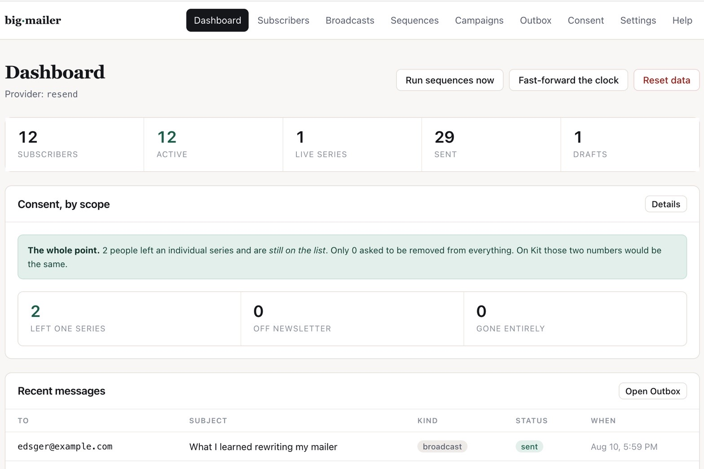

# big-mailer 📬

**Broadcasts, drip sequences, and transactional email in one Cloudflare Worker.**
A self-hosted replacement for a paid ESP, where the list, the sending, and the
engagement data stay yours.

[](LICENSE)
[](tsconfig.json)
[](https://workers.cloudflare.com/)

> **Status:** feature-complete and runnable locally, not yet deployed. It is built for a
> **single operator** and is not multi-tenant, by design rather than by omission.
> See [Before deploying](#before-deploying) for the honest list of what's left.



<sub>The dashboard after seeding demo data. **Consent, by scope** is the panel that
matters: two people left an individual series and are still on the list. On a normal
ESP those two numbers are the same number.</sub>

---

## The idea 💡

Every ESP treats unsubscribe as one switch. Someone finishes your onboarding series,
clicks "unsubscribe" to stop *that*, and quietly leaves your newsletter forever. You
never find out. The number just goes down.

**Here, consent is scoped.** Leaving one sequence takes you off that sequence. Leaving
the newsletter doesn't cancel a series you deliberately opted into. Only an explicit
"unsubscribe from everything", a hard bounce, or a spam complaint removes someone
outright.

That asymmetry is the reason this exists, and everything else in the codebase is
arranged so it can't be broken by accident.

---

## Run it 🚀

```bash
bun install
bun run db:migrate     # applies migrations to the local D1 database
bun run dev            # http://localhost:8787
```

Open <http://localhost:8787> and click **Seed demo data**: twelve people, two live
series, a sent broadcast. Then open the **Outbox** to read the mail that "went out."

Nothing leaves your machine. `EMAIL_PROVIDER=console` is the local default and writes
fully rendered mail to the in-app Outbox instead of sending it. No API key needed, and
no way to accidentally mail a real person while you poke at it.

## Try the thing it's for 🎯

1. **Subscribers** → pick someone → **Open their preference center**
2. Add `?scope=sequence:2` to that URL. This is what a link inside a sequence email
   looks like.
3. Hit **Stop just this series**
4. Go back to their subscriber page: still `active`, still on the newsletter, out of
   exactly one series
5. **Consent** shows everyone who left a single series versus the (empty) list of
   people gone entirely

Send a broadcast afterwards and they'll still receive it. That's the whole argument.

Sequence delays are in **days**, and the first step defaults to 0 (arrives on join)
while later steps default to 1. Which means a seeded series won't finish while you
watch it, so the dashboard has **Fast-forward the clock** (local only): it pulls every
pending step to now and runs a tick. Use it and you'll watch step 2 skip the people
who left that series.

---

## What's in here 🗂

```
src/
  worker.tsx      fetch + scheduled + queue handlers — the whole entry point, 151 lines
  core/           domain logic: consent, sending, sequences, segments, rendering
  db/             Drizzle schema (24 tables) and the D1 client
  web/            server-rendered admin console (Hono + JSX, no frontend framework)
  api/            transactional send API, signup forms, media upload, bearer-key auth
  mcp/            MCP server — 93 tools, 4 resources, 4 prompts
  providers/      EmailProvider port + console and Resend adapters
  client/         the only browser JS in the project: the TipTap editor bundle
migrations/       drizzle-kit generated, applied by wrangler
docs/             problem brief, architecture, spec, and a decision log
```

Roughly 16k lines of TypeScript. `bun run typecheck` covers the Worker and the browser
bundle separately and is clean.

---

## Architecture at a glance 🧱

Cloudflare Workers · D1 (SQLite) via Drizzle · Queues for send fan-out · Cron Triggers
for scheduling · R2 for media · Hono + JSX server-rendered admin · Cloudflare Access for
auth · a pluggable `EmailProvider` port with `console` and Resend adapters.

The decisions worth knowing about, and why:

**Every `messages` row is materialized before a single send goes out.** A broadcast
resolves its full recipient list up front, writes a row per intended send, and only
then fans out to the queue. That makes a broadcast resumable after a crash, idempotent
across queue retries, and auditable afterward. Resolving recipients lazily at send time
is cheaper and turns any mid-broadcast failure into an unrecoverable mess.

**Consent is re-checked immediately before the provider call, not at enqueue time.**
A queue can deliver minutes after the message was created, and someone can opt out in
between. Checking at enqueue would mail them anyway.

**Queue concurrency is pinned to 6.** One batch is one provider request, so batch
concurrency *is* the request rate. Left unset, Cloudflare Queues autoscales to 250
concurrent consumers, buries Resend's 10 req/s limit under 429s, burns all three
retries, and dead-letters perfectly good mail. Six batches of 100 leaves ~600
emails/sec of headroom while staying under the limit.

**Suppression is keyed by email address, not by subscriber.** Transactional recipients
and bounced addresses often have no subscriber row at all, so a `subscribers.status`
flag would silently miss them.

**Anything observable is a row in D1, never a log line.** Workers logs expire in 3–7
days. An audit trail with a one-week retention isn't one. `mcp_calls` records every
agent action including the refusals; `sync_runs` records every Stripe pull.

**The admin console has no password.** Cloudflare Access terminates identity at the
edge, and `src/web/auth.ts` verifies the forwarded JWT properly: signature against the
team's live JWKS (cached per isolate, with a forced refetch on an unknown key id),
`alg` pinned to `RS256`, plus audience, issuer, `exp` and `nbf`. Presence of the header
proves nothing and is never treated as proof. Misconfigure it and the middleware
**fails closed** and locks everyone out, including you. That's the correct direction to
fail.

**The email HTML renderer is hand-written** (`core/render-doc.ts`) rather than using
`@tiptap/html`, whose server entry point needs `happy-dom` and doesn't run inside
`workerd`. It turned out to be the better answer anyway: the walker inlines every style
(Gmail strips `<style>`) and emits nested tables for buttons (Outlook ignores padding
on `<a>`), which generic HTML serialization wouldn't do.

The full decision log, including the alternatives that were rejected and why, is in
[`docs/MEMORY.md`](docs/MEMORY.md).

---

## Consent model 🔐

Three independent scopes. A narrow choice never escalates to a wide one.

| Scope | Stored as | Effect |
|---|---|---|
| Sequence | `sequence_optouts` row | Off that one series. Everything else continues. |
| Broadcast | `subscribers.status` | Off the newsletter. Series keep running. |
| Global | `suppressions` row | Off everything. The legal escape hatch. |

Only an explicit "unsubscribe from everything", a hard bounce, or a complaint writes a
global suppression.

Sequence sends deliberately ignore `status = 'unsubscribed'`, because that flag is
broadcast-scoped: someone who left the newsletter still gets the onboarding series they
asked for. Transactional mail (receipts, downloads) ignores marketing consent entirely
and is blocked only by a dead address or a spam complaint. A receipt isn't marketing,
and an unsubscribed customer still needs their download.

---

## The editor ✍️

Block-style rich text, TipTap v3, vanilla (no React). Open the seeded draft
**"Draft: everything the editor can do"** to see the lot.

- `/` on a line → block menu: headings, lists, checklist, quote, code, table, toggle,
  divider, image, YouTube, CTA button
- `@` → personalization fields as real nodes, so `first_name` can't be misspelled
- Drag the handle in the left margin to reorder; shift-select spans multiple blocks
- Drop or paste an image anywhere → uploads to R2, inserts when the URL returns
- Code blocks are syntax-highlighted (15 languages, incl. Ruby, Elixir, TS, SQL)
- Select text for the bubble menu; select a **button** and the bubble menu becomes its
  URL and colour picker

**Buttons and merge tags are custom nodes** built specifically for email. A CTA renders
as a nested table, and every style is inlined. A merge tag is a node rather than raw
`{{first_name}}` text, because a typo in raw text mails "Hi {{frist_name}}" to the
entire list.

Bodies are stored as TipTap JSON in `body_json`. Legacy markdown in `body_md` still
renders and is converted the moment you open it in the editor. Nothing is migrated in
bulk, because a bulk migration that goes wrong takes the archive with it.

The client bundle is ~226KB gzipped and loads only on the two screens that compose
mail. Everything else in the admin console is server-rendered with zero JavaScript.

There's a browser smoke test (`bun run smoke`, 33 checks) driving real Chromium,
because a renamed extension option fails silently in the browser and the body field
just never saves. Nothing server-side can catch that.

---

## Drive it from Claude Code 🤖

The Worker serves an MCP server at `POST /mcp/<secret>`: **93 tools** covering the
whole mailer, so an agent can cut segments, draft and send broadcasts, build sequences,
read campaign performance, and reconcile Stripe.

```bash
# 1. a path secret (this is what makes the endpoint exist at all)
openssl rand -hex 24                      # → put in .dev.vars as MCP_PATH_SECRET

# 2. an admin-scoped key — POST /seed prints one, or use apikey_create

# 3. point Claude Code at it
claude mcp add --transport http --scope local \
  --header "Authorization: Bearer $BIG_MAILER_KEY" \
  big-mailer "http://localhost:8787/mcp/$MCP_PATH_SECRET"
```

**Three gates, cheapest first.** An unguessable path secret compared in constant time
(a miss returns `404`, not `403`, because a URL nobody guessed should look like nothing
is there), then an `admin`-scoped bearer key (transactional `send` keys can't reach
it), then per-tool guards. Every call lands in `mcp_calls`, including the refusals.

**Irreversible sends need a preflight.** `broadcast_send` refuses without a token from
`broadcast_preflight`: single-use, 10-minute expiry, invalidated by any edit to the
content or the audience. Same for `sequence_activate`. On top of that, `MCP_ALLOW_SEND`
is `"false"` in production, so MCP can read and draft everything but cannot put mail on
the wire until you deliberately flip it. Flipping it back is the instant off-switch.

Agents should read `bigmailer://conventions` before touching consent. Scoped
unsubscribe is not the shape anything trained on normal ESPs expects, and getting it
wrong is exactly the failure this project was built to avoid.

---

## Stripe → campaign attribution 💳

Set `STRIPE_SECRET_KEY` (restricted, read-only on charges/refunds/customers). A daily
cron at 09:17 UTC pulls new charges and credits each to the buyer's last attribution
touch, or to `metadata.campaign` when the charge carries one. Idempotent on the Stripe
charge id, so re-runs and overlapping backfills are harmless.

`stripe_sync_preview` dry-runs it, `sales_unattributed` is the worklist of what the
heuristic couldn't place, and `sync_runs_list` proves the nightly job is actually
running.

---

## Commands ▶️

| | |
|---|---|
| `bun run dev` | Build the client bundle, then serve on :8787 |
| `bun run watch:client` | Rebuild the editor bundle on change (alongside `dev`) |
| `bun run smoke` | Browser smoke test of the editor. Needs `dev` running |
| `bun run db:migrate` | Apply migrations to local D1 |
| `bun run db:generate` | Generate a migration after editing `src/db/schema.ts` |
| `bun run db:studio` | Drizzle Studio against the local database |
| `bun run typecheck` | Typechecks the Worker and the browser bundle separately |
| `bun run deploy` | Build, then `wrangler deploy --env production`. Read the section below first |

---

## Sending for real 📮

Copy `.dev.vars.example` to `.dev.vars`, add a Resend key, and set
`EMAIL_PROVIDER=resend`. Point Resend's webhook at `/webhooks/resend` so bounces and
complaints suppress properly. Without that webhook, bad addresses never get suppressed
and your sending reputation degrades silently, which is the slow way to lose
deliverability for the whole domain.

Secrets go in `.dev.vars` (gitignored) or `wrangler secret put`. Never in
`wrangler.jsonc`, and never in `.dev.vars.example`.

<a id="before-deploying"></a>

## ⚠️ Before deploying

Not deployed yet, and there is real setup between here and live:

- **`DEV_AUTH_BYPASS=true`** sits in the top-level `wrangler.jsonc` vars so the app is
  runnable locally. `--env production` sets it false. **A bare `wrangler deploy`
  publishes an unauthenticated admin console**, which is why `bun run deploy` hard-codes
  `--env production`. Don't work around it.
- **`database_id` is a placeholder.** Create a real D1 database with
  `wrangler d1 create`.
- **Create the R2 bucket** (`big-mailer-media`) and the two queues
  (`big-mailer-send`, `big-mailer-dlq`). Queues need the $5/mo Workers paid plan.
- **Set `PUBLIC_URL` to the real host.** It's baked into tracking links and image URLs
  *at send time*, so a wrong value ships permanently broken email to mail that's
  already delivered. It cannot be fixed after the fact.
- **`MCP_PATH_SECRET` must be a real secret** (`wrangler secret put`), not a var. Unset
  means the MCP endpoint 404s, which is the safe default. Turn it on deliberately.
- **Cloudflare Access needs one Allow app and several Bypass apps.** Protecting the
  whole hostname with a single Allow policy also protects the tracking pixel, signup
  forms, preference center, webhooks, and MCP, which means every tracking pixel in
  every email you send redirects to a login screen, permanently, for mail already
  delivered. Access matches the most specific path first, so `/t`, `/f`, `/p`,
  `/api`, `/webhooks` and `/mcp` each need their own Bypass app. Each of those carries
  its own auth or is public by design.
- **No server-side test suite.** `bun run smoke` covers the editor.
  [`docs/SPEC.md`](docs/SPEC.md) is written as numbered, testable requirements, shaped
  to be made executable.

---

## Docs 📚

| | |
|---|---|
| [`docs/PROJECT.md`](docs/PROJECT.md) | The problem, who it's for, and what's explicitly out of scope |
| [`docs/ARCHITECTURE.md`](docs/ARCHITECTURE.md) | System design, data model, and the send pipeline |
| [`docs/SPEC.md`](docs/SPEC.md) | Numbered behavioral requirements. The reference for intended behavior |
| [`docs/MEMORY.md`](docs/MEMORY.md) | Decision log: what was chosen, what was rejected, and why |

---

## Contributing 🤝

Bug reports, correctness fixes, and email-client rendering fixes are very welcome.
Multi-tenancy, a drag-and-drop builder, and self-run SMTP are out of scope on purpose.
See [`CONTRIBUTING.md`](CONTRIBUTING.md) before opening a PR, and
[`SECURITY.md`](SECURITY.md) if you've found a vulnerability (please report it
privately, not as an issue).

Forking is genuinely encouraged. This is small enough to read end to end and make your
own. Participation is covered by the [Code of Conduct](CODE_OF_CONDUCT.md).

## License 📄

[MIT](LICENSE) © Rob Conery
